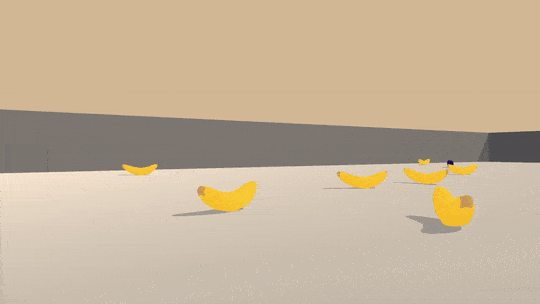

# DRLND-project-1
This repository contains an implementation of project 1 for [Udacity's Deep Reinforcement Learning Nanodegree](https://www.udacity.com/course/deep-reinforcement-learning-nanodegree--nd893).

## Project details

This project implements a Deep Q-Learning Network for solving a Unity environment that can navigate and collect
bananas in a large, square world.

Recording of final implementation:



A reward of +1 is provided for collecting a yellow banana, and a reward of -1 is provided for collecting a blue banana.
The goal of the agent is to collect as many yellow bananas as possible, while avoiding the blue bananas.

The state space has 37 dimensions pre-computed by the environment.  The action space has four discrete actions,
corresponding to moving forward, backward, turning left or turning right.

The task is episodic, and it is considered solved when the agent gets an average score of +13 over 100 consecutive
episodes.

## Getting started

### Dependencies

Dependencies for this project can be setup as per dependencies for the [DRL repository](https://github.com/udacity/deep-reinforcement-learning#dependencies).  The instructions below
walk you through setting up this environment:

1. Create (and activate) a new environment with Python 3.6.
    * Linux or Mac:
    ```
    conda create --name drlnd python=3.6
    source activate drlnd
    ```
    * Windows:
    ```
    conda create --name drlnd python=3.6
    conda activate drlnd
    ```

2. Perform a minimal install of the OpenAI gym, as instructed on [this repository](https://github.com/openai/gym),
or the very helpful instructions at [Open AI Spinning Up](https://spinningup.openai.com/en/latest/user/installation.html).
    * Note that openmpi is not natively supported on Windows 10; I had luck installing instead the [Microsoft MPI](https://docs.microsoft.com/en-us/message-passing-interface/microsoft-mpi).

3. Clone this repository, and install its dependencies:
    ```
    git clone https://github.com/telmo-correa/DRLND-project-1
    cd DRLND-project-1
    pip install .
    ```
    
    * Note that there seems to be issues installing unityagents on Windows 10 -- conda looks for a required version of
    pytorch that does not seem to be available.  [Commenting out that requirement and installing pytorch separately](https://github.com/udacity/deep-reinforcement-learning/issues/13#issuecomment-475455429)
    worked for me.
 
4. Create an [IPython kernel](http://ipython.readthedocs.io/en/stable/install/kernel_install.html) for the ```drlnd``` environment:
    ```
    python -m ipykernel install --user --name drlnd --display-name "drlnd"
    ```

5. Run the Jupyter notebook using the newly created kernel:


### Downloading the Unity environment

Different versions of the Unity environment are required on different operational systems.

* Linux: [click here](https://s3-us-west-1.amazonaws.com/udacity-drlnd/P1/Banana/Banana_Linux.zip)
* Mac OSX: [click here](https://s3-us-west-1.amazonaws.com/udacity-drlnd/P1/Banana/Banana.app.zip)
* Windows (32-bit): [click here](https://s3-us-west-1.amazonaws.com/udacity-drlnd/P1/Banana/Banana_Windows_x86.zip)
* Windows (64-bit): [click here](https://s3-us-west-1.amazonaws.com/udacity-drlnd/P1/Banana/Banana_Windows_x86_64.zip)

Download the corresponding zip file and unpack it.  You will need to point to the location of the file
within the ```Navigation.ipynb``` and ```Report.ipynb``` notebooks in order to run them.

## Instructions

The problem and the environment are available on the ```Navigation.ipynb``` notebook.

The implementation is provided on the ```Report.ipynb```notebook, along with a discussion of its details.
